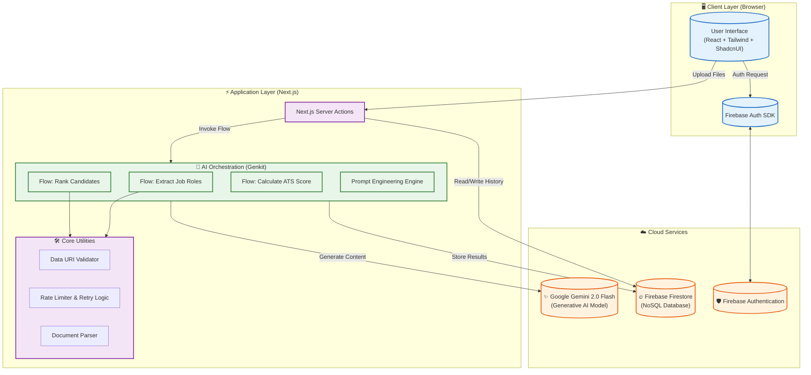
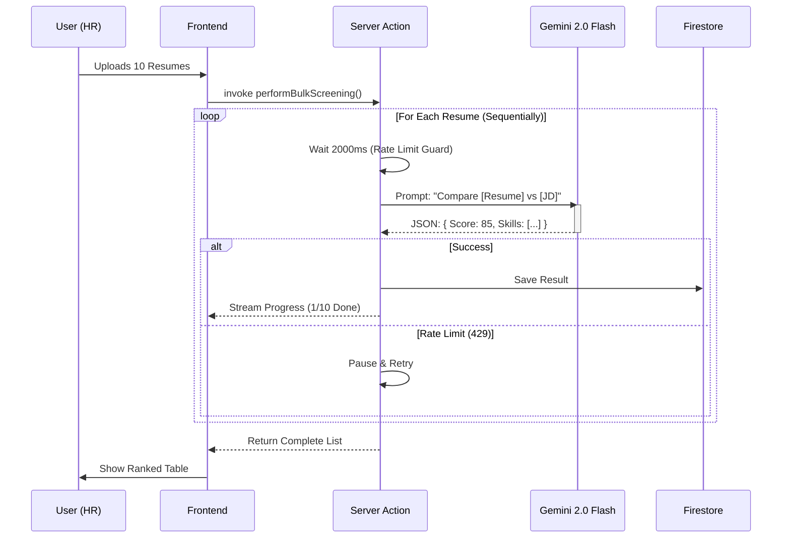

# AI-Powered Recruiter System - Technical Documentation

## 1. Executive Summary
The **AI-Powered Recruiter** is an intelligent automated hiring assistant designed to streamline the recruitment process. By leveraging Google's **Gemini 2.0 Flash** model via the **Genkit** framework, the system automates the analysis of job descriptions (JDs) and candidate resumes. It provides quantitative ranking (0-100 scores), qualitative feedback, and ATS (Applicant Tracking System) compatibility analysis, significantly reducing the manual workload for HR professionals.

## 2. High-Level Architecture

The system follows a modern **Serverless / Edge-ready** architecture powered by Next.js and Firebase.

## 3. Core Features & Functions

### 3.1 📄 Intelligent Job Role Extraction
*   **Function**: Converts raw unstructured PDF/link JDs into structured data.
*   **Process**:
    1.  User uploads a Job Description (PDF/DOCX).
    2.  System converts file to Data URI.
    3.  **Genkit Flow** invokes Gemini to analyze text.
    4.  **AI Output**: Extracts Job Title, Key Requirements, and Technical Skills.
    5.  Result is stored as a "Job Role" session.

### 3.2 🏆 Bulk Resume Ranking & Screening
*   **Function**: Scores massive batches of resumes against a specific Job Role.
*   **Process**:
    1.  User selects a Job Role and uploads multiple resumes.
    2.  **Batch Processor** creates a queue (concurrency limited to 1 for Free Tier).
    3.  **AI Analysis**: Each resume is compared against the JD.
    4.  **Scoring**:
        *   **Match Score (0-100)**: Relevance to the role.
        *   **ATS Score (0-100)**: Formatting and keyword optimization.
    5.  **Output**: Structured JSON with Score, Email, Skills, and Feedback.
    6.  **Cost Optimization**: Uses Gemini Flash for low-cost, high-volume processing.

### 3.3 📊 Real-time Dashboard & Analytics
*   **Function**: Visualizes data for decision making.
*   **Key metrics**:
    *   Leaderboard of top candidates.
    *   Filter by score range or specific skills.
    *   Detailed "Why this score?" feedback modal.

### 3.4 📧 Automated Candidate Engagement
*   **Function**: One-click communication.
*   **Features**:
    *   "Email Filtered": Send emails to all candidates matching specific criteria (e.g., Score > 80).
    *   Template-based generation using candidate name and job title.

## 4. Technical Stack & Research

| Component | Technology | Rationale |
| :--- | :--- | :--- |
| **Framework** | **Next.js 14 (App Router)** | Server Actions provide secure, direct backend execution without separate API routes. |
| **AI Framework** | **Google Genkit** | Native TypeScript integration for LLMs, specialized flows, and testing tools. |
| **AI Model** | **Gemini 2.0 Flash** | Best-in-class price/performance ratio. Low latency (Flash) is critical for bulk processing. |
| **Database** | **Firebase Firestore** | Real-time listeners enable live progress updates; flexible schema for varying resume formats. |
| **Styling** | **Tailwind CSS + ShadcnUI** | Rapid UI development with accessible, professional components. |

## 5. Operational Logic & Rate Limiting

The system includes sophisticated logic to handle API constraints, specifically designed for the **Gemini Free Tier**:

### Failure Handling Strategy
1.  **Rate Limiter**: Concurrency set to **1 request/user**.
2.  **Traffic Control**: **2000ms delay** applied between requests to stay under the ~15 RPM (Requests Per Minute) limit.
3.  **Circuit Breaker**: Detects 429 (Too Many Requests) errors and pauses execution to prevent cascading failures.
4.  **Graceful Degradation**: If AI fails for one resume, it is marked as "Extraction Error" without crashing the entire batch.

## 6. Data Flow Diagram (The "Screening" Process)

## 7. Future Scalability
*   **Vector Search**: Implement RAG (Retrieval Augmented Generation) to search internal candidate databases.
*   **Multi-Modal Analysis**: Analyze candidate portfolios/Github links.
*   **Queue System**: Move PDF processing to a background job queue (e.g., Redis/BullMQ) for handling 1000+ resumes.
