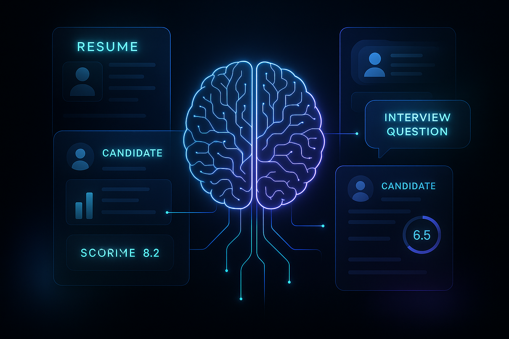

# ResumeRank AI 🚀

An AI-powered suite designed to streamline and revolutionize your recruitment workflow.



## 📝 Overview

ResumeRank AI is a modern, full-stack web application built to help recruiters and hiring managers make smarter, faster, and data-driven hiring decisions. By leveraging the power of Google's Gemini AI through Genkit, this platform automates the tedious tasks of resume screening, candidate ranking, and interview preparation, allowing you to focus on what truly matters: finding the best talent.

This project is built with a production-ready stack and serves as a comprehensive example of integrating modern web technologies with cutting-edge AI capabilities.

---

## ✨ Key Features

-   **🧠 AI Resume Ranker**: Upload multiple job descriptions and resumes to intelligently rank candidates. The AI provides a match score, ATS compatibility score, and detailed feedback for each candidate.
-   **📊 ATS Score Finder**: Analyze individual resumes for Applicant Tracking System (ATS) compatibility. Get actionable suggestions to optimize resumes for automated screening processes.
-   **❓ AI Interview Question Generator**: Automatically generate a comprehensive set of technical, behavioral, situational, and role-specific interview questions by simply uploading a job description.
-   **🔐 Secure Authentication & Data Storage**: Built-in user authentication (Sign Up/Login) powered by Firebase Authentication. All user data, including uploaded roles and screening results, is securely stored in Firestore and tied to the user's account.
-   **📱 Fully Responsive Design**: A sleek and modern UI built with ShadCN and Tailwind CSS, ensuring a seamless experience on both desktop and mobile devices.
-   **🎨 Light & Dark Mode**: A beautiful, themeable interface that respects user preferences.

---

## 🛠️ Tech Stack

-   **Framework**: [Next.js](https://nextjs.org/) (React)
-   **Generative AI**: [Google AI (Gemini) via Genkit](https://firebase.google.com/docs/genkit)
-   **Backend & DB**: [Firebase](https://firebase.google.com/) (Authentication, Firestore)
-   **Styling**: [Tailwind CSS](https://tailwindcss.com/)
-   **UI Components**: [ShadCN UI](https://ui.shadcn.com/)
-   **Deployment**: Ready for [Firebase App Hosting](https://firebase.google.com/docs/app-hosting)

---

## 🏗️ Architecture Diagram

```
┌─────────────────────────────────────────────────────────────────────────────┐
│                            ResumeRank AI Architecture                       │
└─────────────────────────────────────────────────────────────────────────────┘
                                      │
                                      ▼
┌─────────────────────────────────────────────────────────────────────────────┐
│                           User Interface Layer                              │
│                                                                             │
│  ┌─────────────────┐  ┌─────────────────┐  ┌─────────────────┐              │
│  │   Landing Page  │  │   Dashboard     │  │   Auth Pages    │              │
│  │   (Next.js)     │  │   (Protected)   │  │   (Login/Signup)│              │
│  └─────────────────┘  └─────────────────┘  └─────────────────┘              │
│                                                                             │
│  ┌─────────────────┐  ┌─────────────────┐  ┌─────────────────┐              │
│  │ Resume Ranker   │  │ ATS Score Finder│  │ Interview Q Gen │              │
│  │   Feature       │  │   Feature       │  │   Feature       │              │
│  └─────────────────┘  └─────────────────┘  └─────────────────┘              │
│                                                                             │
│  Built with: Next.js (App Router), React, ShadCN UI, Tailwind CSS           │
└─────────────────────────────────────────────────────────────────────────────┘
                                      │
                                      ▼
┌─────────────────────────────────────────────────────────────────────────────┐
│                        Authentication & Data Layer                          │
│                                                                             │
│  ┌─────────────────┐  ┌─────────────────┐  ┌─────────────────┐              │
│  │ Firebase Auth   │  │ Firestore DB    │  │ User Sessions   │              │
│  │ (Email/Password)│  │ (NoSQL)         │  │ (Secure)        │              │
│  └─────────────────┘  └─────────────────┘  └─────────────────┘              │
│                                                                             │
│    Stores: User data, Job Descriptions, Resumes, Screening Results          │
└─────────────────────────────────────────────────────────────────────────────┘
                                      │
                                      ▼
┌─────────────────────────────────────────────────────────────────────────────┐
│                            AI Processing Layer                              │
│                                                                             │
│  ┌─────────────────┐  ┌─────────────────┐  ┌─────────────────┐              │
│  │   Genkit Flows  │  │   AI Prompts    │  │   Data Analysis │              │
│  │  (Server Actions│  │   (Structured)  │  │   (Resume/JD)   │              │
│  │   in Next.js)   │  │                 │  │                 │              │
│  └─────────────────┘  └─────────────────┘  └─────────────────┘              │
│                                                                             │
│  Flows: Rank Candidates, Calculate ATS Score, Generate Interview Questions  │
│                                                                             │
│  ┌─────────────────┐                                                        │
│  │ Google AI Gemini│                                                        │
│  │   (LLM Model)   │                                                        │
│  └─────────────────┘                                                        │
│                                                                             │
│  Powered by: Genkit Framework, Google AI API                                │
└─────────────────────────────────────────────────────────────────────────────┘
                                      │
                                      ▼
┌─────────────────────────────────────────────────────────────────────────────┐
│                            Deployment & Hosting                             │
│                                                                             │
│  ┌─────────────────┐  ┌─────────────────┐  ┌─────────────────┐              │
│  │ Firebase App    │  │   CI/CD         │  │   Environment   │              │
│  │   Hosting       │  │   (GitHub)      │  │   Variables     │              │
│  └─────────────────┘  └─────────────────┘  └─────────────────┘              │
│                                                                             │
│          Ready for production deployment with Firebase                      │
└─────────────────────────────────────────────────────────────────────────────┘
```

### Architecture Description

The architecture of ResumeRank AI is designed as a modern, scalable full-stack web application that integrates cutting-edge AI capabilities with robust backend services. It follows a layered architecture pattern to ensure separation of concerns, maintainability, and extensibility.

#### 1. **User Interface Layer**
   - **Technology**: Next.js with App Router, React components, ShadCN UI library, Tailwind CSS for styling.
   - **Purpose**: Provides the frontend interface for user interactions, including landing pages, authentication forms, dashboard, and feature-specific pages (Resume Ranker, ATS Score Finder, Interview Question Generator).
   - **Key Features**: Responsive design, light/dark mode support, drag-and-drop file uploads, real-time loading indicators, and toast notifications.
   - **Data Flow**: Handles user input (file uploads, form submissions), displays results, and manages client-side state with React contexts (AuthContext, LoadingContext).

#### 2. **Authentication & Data Layer**
   - **Technology**: Firebase Authentication and Firestore NoSQL database.
   - **Purpose**: Manages user authentication (email/password), session handling, and secure data storage.
   - **Data Storage**: User profiles, uploaded job descriptions (as data URIs), candidate resumes, screening results, and generated interview questions.
   - **Security**: All data is tied to authenticated users, ensuring privacy and data isolation.

#### 3. **AI Processing Layer**
   - **Technology**: Genkit framework integrated with Google AI's Gemini 2.0 Flash model.
   - **Purpose**: Handles all AI-driven operations through structured flows and prompts.
   - **Key Components**:
     - **AI Flows**: Server-side functions (rank-candidates, calculate-ats-score, extract-job-roles, generate-jd-interview-questions) that orchestrate AI processing.
     - **Prompts**: Structured prompts that guide the LLM to perform specific tasks like resume analysis, scoring, and question generation.
     - **Data Processing**: Converts uploaded files to data URIs for AI consumption, processes AI responses, and formats results for frontend display.
   - **AI Capabilities**: Leverages Gemini's natural language understanding for intelligent candidate ranking, ATS compatibility analysis, and contextual interview question creation.

#### 4. **Deployment & Hosting Layer**
   - **Technology**: Firebase App Hosting for seamless deployment, GitHub Actions for CI/CD.
   - **Purpose**: Ensures reliable, scalable hosting with automatic builds and environment management.
   - **Configuration**: Environment variables for API keys, Firebase config, and other secrets.

#### Data Flow Overview
1. **User Interaction**: User uploads job descriptions and resumes via the UI.
2. **Authentication**: Firebase Auth verifies user identity.
3. **Data Storage**: Files are temporarily processed and stored in Firestore.
4. **AI Processing**: Genkit flows invoke Google AI Gemini to analyze documents and generate results.
5. **Result Delivery**: Processed data (scores, feedback, questions) is stored and displayed to the user.
6. **Persistence**: All results are saved in Firestore for future access and analysis.

This architecture ensures high performance, security, and scalability while providing a seamless user experience for AI-powered recruitment workflows.

---

## 🚀 Getting Started

Follow these instructions to get a copy of the project up and running on your local machine for development and testing purposes.

### Prerequisites

-   [Node.js](https://nodejs.org/en/) (v18 or later recommended)
-   [npm](https://www.npmjs.com/) or [yarn](https://yarnpkg.com/)
-   A [Firebase](https://firebase.google.com/) project.
-   A [Google AI API Key](https://aistudio.google.com/app/apikey).

### 1. Clone the Repository

```bash
git clone https://github.com/your-username/resumerank-ai.git
cd resumerank-ai
```

### 2. Install Dependencies

```bash
npm install
```

### 3. Set Up Environment Variables

You'll need to provide your secret keys for Firebase and Google AI. Create a file named `.env.local` in the root of the project by copying the example file:

```bash
cp .env.example .env.local
```

Now, open `.env.local` and fill in the required values.

#### **How to get your Firebase credentials:**

1.  Go to your [Firebase Console](https://console.firebase.google.com/).
2.  Create a new project (or select an existing one).
3.  In your project, go to **Project Settings** (the gear icon).
4.  Under the "General" tab, scroll down to "Your apps".
5.  Click the **Web** icon (`</>`) to create a new web app.
6.  Give it a nickname and register the app.
7.  Firebase will provide you with a `firebaseConfig` object. Copy the values from this object into the corresponding `NEXT_PUBLIC_FIREBASE_*` variables in your `.env.local` file.
8.  Enable **Authentication** (with Email/Password provider) and **Firestore Database** in the Firebase console.

#### **How to get your Google AI API key:**

1.  Visit [Google AI Studio](https://aistudio.google.com/app/apikey).
2.  Click "Create API key in new project".
3.  Copy the generated API key and paste it as the `GOOGLE_API_KEY` value in your `.env.local` file.

### 4. Run the Development Server

Once your environment variables are set, you can run the application:

```bash
npm run dev
```

The application should now be running on [http://localhost:3000](http://localhost:3000).

---

## 📁 Folder Structure

The project follows a standard Next.js App Router structure with some key directories:

```
/
├── src/
│   ├── app/                # Main application pages and layouts
│   ├── ai/                 # Genkit AI flows and configuration
│   ├── components/         # Reusable UI components
│   ├── contexts/           # React contexts (Auth, Loading)
│   ├── hooks/              # Custom React hooks (useToast)
│   ├── lib/                # Libraries, utilities, and type definitions
│   └── services/           # Firestore service functions
├── public/                 # Static assets (images, fonts)
└── .env.local              # Your secret environment variables (ignored by Git)
```
---

## 📞 Contact

Created by [Your Name] - feel free to reach out!
