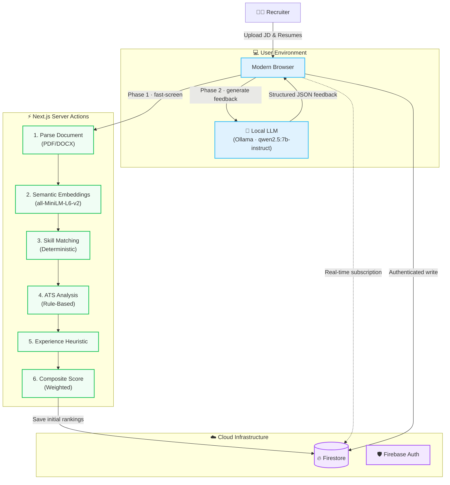

# AI Recruiter 🚀

**The Next-Generation Hybrid Recruitment Platform**


## 📝 Overview

**AI Recruiter** is a production-grade, privacy-first recruitment platform designed to revolutionize how talent is screened. Unlike traditional cloud-only solutions, AI Recruiter employs a novel **Hybrid Architecture** that combines the speed of server-side deterministic scoring with the depth of **Local LLM Intelligence (Ollama)**.

This approach ensures **Zero-Latency Screening** while providing rich, human-like qualitative feedback without sending sensitive candidate data to external third-party AI APIs for deep analysis.

---

## ✨ Key Features

### 🧠 Hybrid Intelligence Engine
-   **Phase 1: Fast Ranking (Server-Side)**: The Next.js server parses resumes, computes semantic embeddings, matches skills, runs ATS analysis, and produces a composite score — all without any cloud AI calls. Results appear in seconds.
-   **Phase 2: Cognitive Analysis (Client-Side Local LLM)**: The browser connects directly to a locally running **`qwen2.5:7b-instruct`** model via **Ollama** to act as a "Senior Recruiter," generating nuanced, structured JSON feedback on candidate soft skills and potential red flags. No data leaves your machine.

### 🎨 Premium User Experience
-   **Glassmorphism UI**: A stunning, modern interface built with **ShadCN UI** and **Tailwind CSS**.
-   **Professional Dark Mode**: Carefully calibrated "Neutral Zinc" palette for deep contrast and reduced eye strain.
-   **Reactive Dashboard**: Real-time progress tracking, interactive charts, and seamless drag-and-drop uploads.

### 🛠️ Powerful Toolset
-   **Resume Ranker**: Bulk-screen hundreds of resumes against a Job Description with instant ranking and streamed AI feedback.
-   **ATS Score Finder**: Deep-dive analysis of individual resumes against specific job descriptions.
-   **Interview Question Generator**: Context-aware question generation tailored to the specific gaps found in a candidate's profile.
-   **Secure Data Handling**: Powered by **Firebase Auth** and **Firestore** with strict security rules—your data belongs to you.

---

## 🏗️ Architecture Diagram

The system uses a **Progressive Enhancement** pattern — instant deterministic results first, rich AI feedback second.


```mermaid
flowchart TD
    subgraph Client [💻 User Environment]
        Browser["Modern Browser"]
        LocalAI["🦙 Local LLM\n(Ollama · qwen2.5:7b-instruct)"]
    end

    subgraph Server [⚡ Next.js Server Actions]
        Parse["1. Parse Document\n(PDF/DOCX)"]
        Embed["2. Semantic Embeddings\n(all-MiniLM-L6-v2)"]
        Skills["3. Skill Matching\n(Deterministic)"]
        ATS["4. ATS Analysis\n(Rule-Based)"]
        Exp["5. Experience Heuristic"]
        Score["6. Composite Score\n(Weighted)"]
    end

    subgraph Cloud [☁️ Cloud Infrastructure]
        DB[("🔥 Firestore")]
        Auth["🛡️ Firebase Auth"]
    end

    User[👩‍💼 Recruiter] -->|Upload JD & Resumes| Browser

    %% Phase 1: Fast Screening
    Browser -->|Phase 1 · fast-screen| Parse
    Parse --> Embed --> Skills --> ATS --> Exp --> Score
    Score -->|Save initial rankings| DB

    %% Phase 2: Deep Analysis
    Browser -.->|Real-time subscription| DB
    Browser -->|Phase 2 · generate feedback| LocalAI
    LocalAI -->|Structured JSON feedback| Browser
    Browser -->|Authenticated write| DB

    classDef client fill:#e0f2fe,stroke:#38bdf8,stroke-width:2px;
    classDef server fill:#f0fdf4,stroke:#22c55e,stroke-width:2px;
    classDef cloud fill:#f3e8ff,stroke:#a855f7,stroke-width:2px;

    class Browser,LocalAI client;
    class Parse,Embed,Skills,ATS,Exp,Score server;
    class DB,Auth cloud;
```

### Phase 1 — Fast Ranking (Server-Side, ~2–4 s/resume)

| Step | What happens |
|------|-------------|
| **1. Parse** | Extracts raw text from PDF (via `pdf-parse`) or DOCX (via `mammoth`) |
| **2. Embed** | Generates 384-dim semantic embeddings with `all-MiniLM-L6-v2` via `@xenova/transformers` (runs in Node.js, no cloud) |
| **3. Skill Match** | Regex-based extraction and scoring of required vs. present skills |
| **4. ATS Analysis** | Rule-based check of formatting, sections, and machine-readability |
| **5. Experience** | Heuristic years-of-experience relevance score |
| **6. Composite Score** | Weighted combination → single 0–100 score with letter grade |

### Phase 2 — AI Feedback (Client-Side Ollama)

The browser calls `http://localhost:11434` directly, so:
- Heavy LLM inference stays off the server (zero cloud cost).
- Sensitive resume text never leaves your local network.
- Feedback is saved back to Firestore through the authenticated client session.

---

## 🛠️ Tech Stack

| Layer | Technology |
|-------|-----------|
| **Frontend** | [Next.js 15](https://nextjs.org/) (App Router, Turbopack), React 18, [ShadCN UI](https://ui.shadcn.com/) |
| **Styling** | [Tailwind CSS](https://tailwindcss.com/) (Custom Zinc Theme), [Framer Motion](https://www.framer.com/motion/) |
| **Semantic Embeddings** | [`@xenova/transformers`](https://github.com/xenova/transformers.js) — `all-MiniLM-L6-v2` (384-dim, runs locally in Node.js) |
| **Local LLM** | [Ollama](https://ollama.com/) — model: **`qwen2.5:7b-instruct`** (primary & fallback) |
| **Document Parsing** | `pdf-parse` (PDF), `mammoth` (DOCX) |
| **Backend** | [Next.js Server Actions](https://nextjs.org/docs/app/building-your-application/data-fetching/server-actions) (50 MB body limit) |
| **Database** | [Firebase Firestore](https://firebase.google.com/docs/firestore) |
| **Auth** | [Firebase Authentication](https://firebase.google.com/docs/auth) |

---

## 🚀 Getting Started

Follow these instructions to set up the **Hybrid AI** environment on your local machine.

### Prerequisites

-   **Node.js 18+** installed.
-   **Ollama** installed and running. ([Download](https://ollama.com/download))
-   **Firebase Project** created.

### 1. Setup Local AI (Ollama)

The Phase 2 feedback engine runs entirely on your machine via Ollama.

```bash
# 1. Install Ollama from https://ollama.com/download

# 2. Pull the instruction-tuned Qwen 2.5 model
ollama pull qwen2.5:7b-instruct

# 3. Start the Ollama server with browser CORS allowed
#    (required so the Next.js client-side code can reach localhost:11434)
OLLAMA_ORIGINS="http://localhost:3000" ollama serve
```

> **Tip — low-VRAM machines:** The model is optimised to run with a 1 024-token context window. On a 4 GB GPU (e.g. RTX 3050) it typically fits in VRAM. If you hit an out-of-memory error, the client automatically retries with the same model at a reduced context. You can override the model via the `OLLAMA_PRIMARY_MODEL` env var (see below).

### 2. Clone the Repository

```bash
git clone https://github.com/your-username/ai-recruiter.git
cd ai-recruiter
```

### 3. Install Dependencies

```bash
npm install
```

> The first time the app starts it will download the `all-MiniLM-L6-v2` ONNX model weights (~23 MB) from Hugging Face into a local cache. This only happens once.

### 4. Configure Environment

Create a `.env.local` file in the root directory:

```bash
# ── Firebase Configuration ──────────────────────────────────────────
NEXT_PUBLIC_FIREBASE_API_KEY=your_api_key
NEXT_PUBLIC_FIREBASE_AUTH_DOMAIN=your_project_id.firebaseapp.com
NEXT_PUBLIC_FIREBASE_PROJECT_ID=your_project_id
NEXT_PUBLIC_FIREBASE_STORAGE_BUCKET=your_project_id.appspot.com
NEXT_PUBLIC_FIREBASE_MESSAGING_SENDER_ID=your_sender_id
NEXT_PUBLIC_FIREBASE_APP_ID=your_app_id

# ── Feature Flags ────────────────────────────────────────────────────
NEXT_PUBLIC_USE_EMULATORS=false
NEXT_PUBLIC_ENABLE_LOCAL_LLM=true

# ── Ollama (optional overrides) ──────────────────────────────────────
# OLLAMA_BASE_URL=http://localhost:11434       # default
# OLLAMA_PRIMARY_MODEL=qwen2.5:7b-instruct    # default
# OLLAMA_FALLBACK_MODEL=qwen2.5:7b-instruct   # default (used on OOM)

# ── Performance ──────────────────────────────────────────────────────
# NEXT_PUBLIC_ENABLE_FAST_MODE=false          # set true to skip LLM (Phase 1 only)
```

### 5. Run the Application

```bash
npm run dev
```

Visit `http://localhost:3000` to access the platform.

---

## 📂 Project Structure

```
/src
├── app/                        # Next.js App Router (pages & layouts)
│   ├── resume-ranker/          # Bulk resume screening
│   ├── ats-score-finder/       # Single-resume ATS analysis
│   ├── interview-question-generator/
│   └── dashboard/
├── ai/
│   ├── embeddings/
│   │   └── embedding-service.ts    # Semantic similarity (all-MiniLM-L6-v2)
│   ├── flows/
│   │   ├── rank-candidates-progressive.ts  # Phase 1 fast ranking (server)
│   │   ├── rank-candidates-hybrid.ts       # Full hybrid pipeline (server)
│   │   ├── extract-job-roles-hybrid.ts
│   │   ├── calculate-ats-score-hybrid.ts
│   │   └── generate-jd-interview-questions-hybrid.ts
│   ├── local-llm/
│   │   ├── ollama-client.ts        # Ollama HTTP client (OOM fallback, timeout)
│   │   └── prompt-templates.ts     # Zod-validated JSON prompt templates
│   └── progressive-enhancement/
│       └── feedback-service.ts     # Phase 2 client-side Ollama feedback
├── components/                 # Reusable UI (ShadCN + custom)
├── contexts/                   # React contexts (Auth, Loading)
├── hooks/                      # Custom React hooks
├── lib/
│   ├── ats/                    # ATS rule-based analyser
│   ├── skills/                 # Skill extraction & matching
│   ├── scoring/                # Composite weighted scorer
│   ├── processing/             # Document parser (PDF + DOCX)
│   └── types.ts                # Shared TypeScript types
└── services/
    └── firestoreService.ts     # Firestore CRUD & real-time subscriptions
```

---

## 🤝 Contributing

We welcome contributions! Specifically, we are looking for:
-   **Prompt Engineering**: Improving the "Senior Recruiter" persona in `feedback-service.ts`.
-   **Algorithm Tuning**: Enhancing the semantic matching logic in `rank-candidates-progressive.ts`.
-   **Model Experiments**: Testing alternative Ollama models (e.g. `llama3`, `mistral`) via the `OLLAMA_PRIMARY_MODEL` env var.

---

### License
MIT
