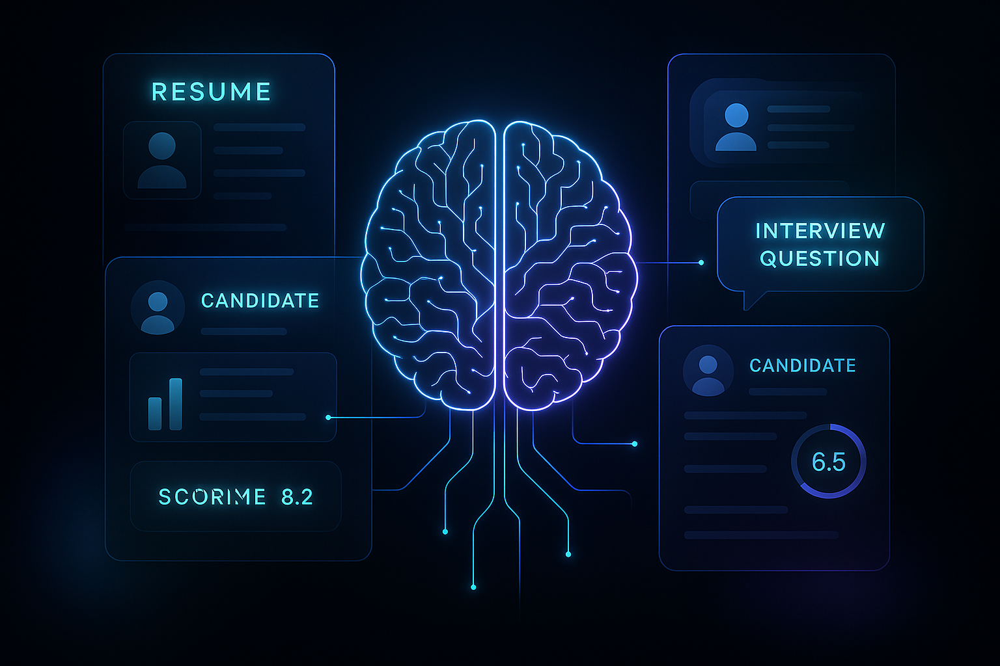

# AI Recruiter 🚀

**The Next-Generation Hybrid Recruitment Platform**



## 📝 Overview

**AI Recruiter** is a production-grade, privacy-first recruitment platform designed to revolutionize how talent is screened. Unlike traditional cloud-only solutions, AI Recruiter employs a novel **Hybrid Architecture** that combines the speed of server-side deterministic scoring with the depth of **Local LLM Intelligence (Ollama)**.

This approach ensures **Zero-Latency Screening** while providing rich, human-like qualitative feedback without sending sensitive candidate data to external third-party AI APIs for deep analysis.

---

## ✨ Key Features

### 🧠 Hybrid Intelligence Engine
-   **Phase 1: Deterministic Speed (Server-Side)**: Instantly parses resumes and ranks them based on hard skills and semantic matching. Zero latency.
-   **Phase 2: Cognitive Analysis (Client-Side Local LLM)**: Uses a locally running **Qwen 2.5** model via **Ollama** to act as a "Senior Recruiter," providing nuanced, human-like feedback on candidate soft skills and potential red flags.

### 🎨 Premium User Experience
-   **Glassmorphism UI**: A stunning, modern interface built with **ShadCN UI** and **Tailwind CSS**.
-   **Professional Dark Mode**: Carefully calibrated "Neutral Zinc" palette for deep contrast and reduced eye strain.
-   **Reactive Dashboard**: Real-time progress tracking, interactive charts, and seamless drag-and-drop uploads.

### 🛠️ Powerful Toolset
-   **ATS Score Finder**: Deep-dive analysis of individual resumes against specific job descriptions.
-   **Interview Question Generator**: Context-aware question generation tailored to the specific gaps found in a candidate's profile.
-   **Secure Data Handling**: Powered by **Firebase Auth** and **Firestore** with strict security rules—your data belongs to you.

---

## 🏗️ Architecture Diagram

The system uses a **Progressive Enhancement** pattern to balance performance and intelligence.

```mermaid
flowchart TD
    subgraph Client [💻 User Environment]
        Browser[Modern Browser]
        LocalAI[🦙 Local LLM (Ollama)]
    end

    subgraph Cloud [☁️ Cloud Infrastructure]
        Server[⚡ Next.js Server Actions]
        DB[(🔥 Firestore)]
        Auth[🛡️ Firebase Auth]
    end

    User[👩‍💼 Recruiter] -->|1. Upload JD & Resumes| Browser
    
    %% Phase 1: Fast Screening
    Browser -->|2. fast-screen (Phase 1)| Server
    Server -->|3. Deterministic Scoring| Server
    Server -->|4. Save Initial Rank| DB
    
    %% Phase 2: Deep Analysis
    Browser -.->|5. Realtime Subscription| DB
    Browser -->|6. Trigger Deep Analysis (Phase 2)| LocalAI
    LocalAI -->|7. Generate Human Feedback| Browser
    Browser -->|8. Secure Write| DB
    
    classDef client fill:#e0f2fe,stroke:#38bdf8,stroke-width:2px;
    classDef cloud fill:#f3e8ff,stroke:#a855f7,stroke-width:2px;
    
    class Browser,LocalAI client;
    class Server,DB,Auth cloud;
```

### Flow Breakdown
1.  **Fast Screen**: The server instantly processes files to give immediate UI feedback.
2.  **Local Inference**: The browser connects to `localhost:11434` (Ollama) to generate expensive textual feedback, saving cloud costs and ensuring privacy.
3.  **Secure Sync**: The authenticated client writes the final detailed feedback to Firestore, ensuring only authorized users modify data.

---

## 🛠️ Tech Stack

-   **Frontend**: [Next.js 14](https://nextjs.org/) (App Router), React, [ShadCN UI](https://ui.shadcn.com/)
-   **Styling**: [Tailwind CSS](https://tailwindcss.com/) (Custom Zinc Theme)
-   **Local AI**: [Ollama](https://ollama.com/) (Model: `qwen2.5:7b`)
-   **Backend**: [Next.js Server Actions](https://nextjs.org/docs/app/building-your-application/data-fetching/server-actions)
-   **Database**: [Firebase Firestore](https://firebase.google.com/docs/firestore)
-   **Auth**: [Firebase Authentication](https://firebase.google.com/docs/auth)

---

## 🚀 Getting Started

Follow these instructions to set up the **Hybrid AI** environment on your local machine.

### Prerequisites

-   **Node.js 18+** installed.
-   **Ollama** installed and running. ([Download](https://ollama.com/download))
-   **Firebase Project** created.

### 1. Setup Local AI (Ollama)

This project relies on a local Large Language Model for Phase 2 feedback.

```bash
# 1. Install Ollama from ollama.com

# 2. Pull the Qwen model (Optimized for reasoning & coding)
ollama pull qwen2.5:7b

# 3. Start the Inference Server (Must align with CORS settings)
ollama serve
```

### 2. Clone the Repository

```bash
git clone https://github.com/your-username/ai-recruiter.git
cd ai-recruiter
```

### 3. Install Dependencies

```bash
npm install
```

### 4. Configure Environment

Create a `.env.local` file in the root directory:

```bash
# Firebase Configuration
NEXT_PUBLIC_FIREBASE_API_KEY=your_api_key
NEXT_PUBLIC_FIREBASE_AUTH_DOMAIN=your_project_id.firebaseapp.com
NEXT_PUBLIC_FIREBASE_PROJECT_ID=your_project_id
NEXT_PUBLIC_FIREBASE_STORAGE_BUCKET=your_project_id.appspot.com
NEXT_PUBLIC_FIREBASE_MESSAGING_SENDER_ID=your_sender_id
NEXT_PUBLIC_FIREBASE_APP_ID=your_app_id

# Feature Flags
NEXT_PUBLIC_USE_EMULATORS=false 
NEXT_PUBLIC_ENABLE_LOCAL_LLM=true
```

### 5. Run the Application

```bash
npm run dev
```
Visit `http://localhost:3000` to access the platform.

---

## 📂 Project Structure

```
/src
├── app/                    # Next.js App Router (Pages & Layouts)
├── ai/
│   ├── flows/              # Server-side Deterministic Logic (Phase 1)
│   └── progressive-enhancement/ 
│       └── feedback-service.ts # Client-side Local LLM Logic (Phase 2)
├── components/             # Reusable UI (ShadCN + Custom)
├── styles/                 # Global styles & Tailwind config
└── services/               # Firestore Service Layer
```

---

## 🤝 Contributing

We welcome contributions! Specifically, we are looking for:
-   **Prompt Engineering**: Improving the "Senior Recruiter" persona in `feedback-service.ts`.
-   **Algorithm Tuning**: Enhancing the semantic matching logic in `rank-candidates-fast.ts`.

---

### License
MIT
